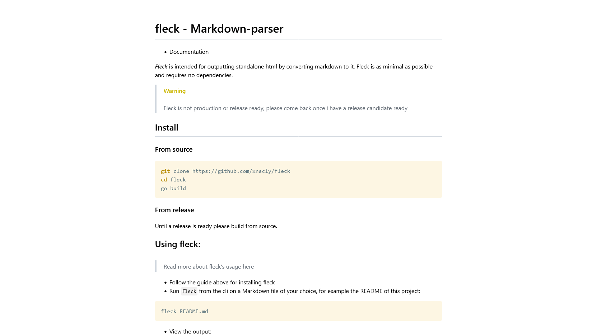

# fleck - Markdown-parser

- [Documentation](./doc/Readme.md)

_Fleck_ **is** intended for outputting standalone html from a markdown source.

Feature overview:

- allmost all the markdown features _(some have bugs, some are missing, don't @ me)_
- syntax highlighting
- custom alert blockquotes
- watch mode for recompiling the html if the source changed
- live-preview in the browser for recompiling the html and reloading the tab if the source changed
- escape html elements
- rendering of latex equations

## Install

### From source

```bash
git clone https://github.com/xnacly/fleck
cd fleck
go build
```

### From release

Until a release is ready please build from source.

## Using fleck:

> Read more about fleck's usage [here](./doc/Usage.md)

- Follow the guide [above](#install) for installing fleck
- Run `fleck` from the cli on a Markdown file of your choice, for example the README of this project:

```bash
fleck README.md
```

- View the output:
  
