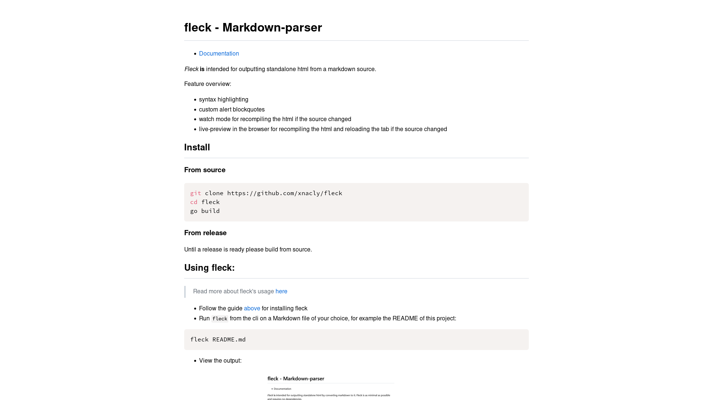

# fleck - Markdown-parser

- [Documentation](./doc/Readme.md)

_Fleck_ **is** intended for outputting standalone html by converting markdown to it.
Fleck is as minimal as possible and requires no dependencies.

> **Warning**
>
> Fleck is not production or release ready, please come back once i have a release candidate ready

## Install

### From source

```bash
git clone https://github.com/xnacly/fleck
cd fleck
go build
```

### From release

Until a release is ready please build from source.

## Using fleck:

> Read more about fleck's usage [here](./doc/Usage.md)

- Follow the guide [above](#install) for installing fleck
- Run `fleck` from the cli on a Markdown file of your choice, for example the README of this project:

```bash
fleck README.md
```

- View the output: 
