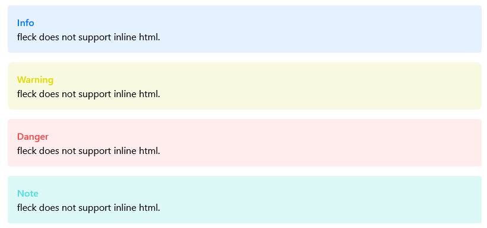

# Features

## Example

View the source for the `test.md` file [here](../test.md).

Compiled using fleck:

```sh
fleck -preprocessor-enabled -toc -toc-full -shell-macro-enabled -syntax -math test.md
# 2023/05/02 15:07:09 warn: 'shell-macro-enabled' flag specified, this can harm your operating system and make it vulnerable for attack, proceed at your own digression
# 2023/05/02 15:07:09 info: preprocessor enabled, starting...
# 2023/05/02 15:07:09 warn: found @shell macro: '@shell{whoami}', executing 'whoami'
# 2023/05/02 15:07:09 info: executed 'whoami' command
# 2023/05/02 15:07:09 info: preprocessor finished, took 4.758821ms
# 2023/05/02 15:07:09 info: created temporary file: 'test.fleck'
# 2023/05/02 15:07:09 info: compiled 'test.fleck', took: 13.646223ms
```

This spits out the following:


## Markdown

Fleck implements the basic markdown features everyone needs, while extending markdown with the fleck dialect, which introduces several macros.

- [x] Headers
- [x] Blockquotes
- [x] unordered Lists
- [ ] to-do lists
- [x] Code blocks
- [x] Code inline
- [x] Bold
- [x] Italic
- [x] Image
- [x] Link
- [x] horizontal ruler

### Extra features

#### Blockquotes:

Fleck supports blockquotes with titles. To specify a title for a blockquote, format it as follows:

```markdown
> **Title**
>
> text
```

Fleck extracts the `Title` in the first line of the blockquote between `**` and `**`.
After that all supported titles are colored and prefixed with a matching emoji.

Currently supported are:

- info
- warning
- danger
- note

Example:



## Fleck's features

- Fleck escapes html characters and does therefore not support inline html.
- Fleck uses prism to provide syntax highlighting for code blocks
- Fleck minifies the output html by default
- Fleck provides a default template for the compiled html to be written to
- Fleck allows the user to view their markdown via a live preview, which recompiles after changes and reloads the page
