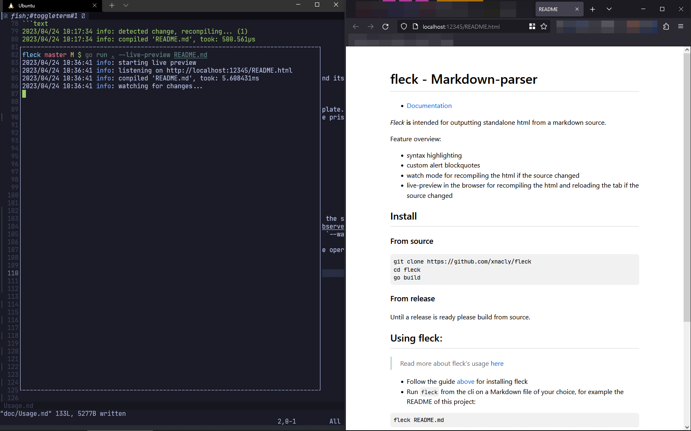
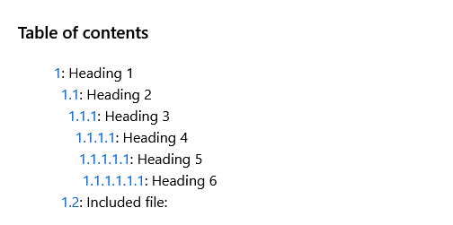

# Usage

## Overview

fleck is called like so:

```bash
# fleck [options] file
fleck README.md
```

This command creates a file called README.html, which includes the generated html output.

## Help

Calling `fleck` with the `--help` flag will produce the following output:

```text
Usage:
    fleck [Options] file

Options:
        Name                    Default         Requires                Description

        --help                  false                                   prints the help page, exists
        --escape-html           false                                   escapes html elements found in the markdown source in the output html
        --watch                 false                                   watches for changes in the specified page, recompiles the file on change
        --syntax                false                                   enables syntax highlighting for code blocks in the output using prism
        --math                  false                                   enables latex math rendering in the output using katex
        --live-preview          false                                   same as watch, serves the compiled html, reloads tab if change occured
        --debug                 false                                   enables debug logs
        --version               false                                   prints version and build information, exists
        --no-prefix             false                                   hide the informational comments generated in the output html
        --no-template           false                                   write html output to a file without the default html scaffolding
        --silent                false                                   disables info logs, reduces output significantly
        --toc                   false                                   generates a table of contents at the top of the output file, includes headings 1,2,3
        --toc-full              false           toc                     generates a full toc, includes headings 1,2,3,4,5,6
        --keep-temp             false           preprocessor-enabled    keeps fleck from removing temporary files, used for debug purposes
        --preprocessor-enabled  false                                   enables the preprocessor to replace macros, decreases performance
        --shell-macro-enabled   false           preprocessor-enabled    enables the dangerous '@shell{command}' macro
        --port                  12345           live-preview            specify the port for '--live-preview' to be served on

Online documentation: https://github.com/xnacly/fleck
```

See [Macros](./Macros.md) for more information about the preprocessor and macros.

## Command line option reference

### --help

Prints the help page, containing the name of all available options, their default values, which other option they require and a description.

A short help is printed if fleck is called without any arguments:

```text
$ fleck
Usage:
    fleck [Options] file

    Run 'fleck --help' for an in depth help page

2023/04/24 10:14:35 error: not enough arguments, specify an input file
exit status 1
```

### --escape-html

Instructs fleck to escape html elements encountered while lexing the markdown source.

```text
$ fleck test.md
2023/05/04 19:41:44 info: compiled 'test.md', took: 459.166µs
$ fleck --escape-html test.md
2023/05/04 19:41:44 info: compiled 'test.md', took: 459.166µs
```

Consider the following snippet:

```markdown
# This is the first heading

<h2 class="heading" id="this-is-the-second-heading">
  This is the second heading
</h2>
```

By default fleck will render it as follows:


But supplied with the `--escape-html`, fleck escapes the given html:


### --watch

The watch option makes fleck watch for changes in the specified source file:

```text
$ fleck --watch README.md
2023/04/24 10:16:13 info: compiled 'README.md', took: 262.228µs
2023/04/24 10:16:13 info: watching for changes...
```

Fleck checks every 100ms if a change occured.
When this happens the screen is cleared and fleck tells the user how many times it already recompiled the source.:

```text
2023/04/24 10:17:34 info: detected change, recompiling... (1)
2023/04/24 10:17:34 info: compiled 'README.md', took: 500.561µs
2023/04/24 10:17:34 info: detected change, recompiling... (2)
2023/04/24 10:17:34 info: compiled 'README.md', took: 720.964µs
```

Fleck checks if the source file changed by comparing its last modification time and its size with the information gathered in the previous iteration.

### --syntax

The `--syntax` flag instructs fleck to inject three assets into the generated template.
The first is the [prism](https://prismjs.com/) default css file. The second is the prism javascript source and the third is the language autoloader, which detects used languages in the generated html and automatically loads the corresponding themes.

```text
$ fleck --syntax README.md
2023/04/24 10:23:18 info: compiled 'README.md', took: 186.067µs
```

A code block in the resulting html, looks like the following:


### --math

The `--math` flag instructs fleck to inject katex with an autoload script into the resulting html. This enables rendering of mathematical expressions typeset with latex.

```text
$ fleck --math --syntax test.md
2023/05/02 14:33:44 info: compiled 'test.md', took: 2.406083ms
```

Inline and block math in the resulting html:


### --live-preview

Just like `--watch`, this option tells fleck to periodically check for changes in the source file.
The drastic difference here is, that fleck starts a websocket connection and a webserver which serves the generated html and injects this html with a javascript script to connect the client to the server.
If fleck detects a change, it recompiles the source, exactly like laid out in the `--watch` reference. After that fleck sends an event to the client via the websocket connection. The client reacts and reloads itself. (HMR via the injected js script is planned, this would allow us to simply use the `body.innerHTML` directive to update the content)

Fleck also opens a tab supplied with the served html in the default browser of the operating system upon starting with the `--live-preview` flag.

```text
$ fleck --live-preview README.md
2023/04/24 10:36:41 info: starting live preview
2023/04/24 10:36:41 info: listening on http://localhost:12345/README.html
2023/04/24 10:36:41 info: compiled 'README.md', took: 5.608431ms
2023/04/24 10:36:41 info: watching for changes...
```

The opened tab in the default browser:



### --port

By default the `--live-preview` is started on port `12345`, to change this behaviour invoke fleck with the `--port=<port>` option:

```text
$ fleck --live-preview --port=12701 README.md
2023/04/24 13:00:52 info: starting live preview
2023/04/24 13:00:52 info: listening on http://localhost:12701/README.html
2023/04/24 13:00:52 info: compiled 'README.md', took: 2.527078ms
2023/04/24 13:00:52 info: watching for changes...
```

### --debug

Debug simply enables more logs:

- lexed tokens, with type, content, position and line:
  ```text
  [ 'HASH' | 0 | 0 | '' ]
  [ 'TEXT' | 1 | 0 | ' fleck ' ]
  [ 'DASH' | 8 | 0 | '' ]
  [ 'TEXT' | 9 | 0 | ' Markdown' ]
  [ 'DASH' | 18 | 0 | '' ]
  [ 'TEXT' | 19 | 0 | 'parser' ]
  [ 'NEWLINE' | 25 | 0 | '' ]
  [ 'EMPTYLINE' | 0 | 1 | '' ]
  ```
- parsed expressions, output as html in console
  ```text
  <h1 id="fleck - Markdown-parser">fleck - Markdown-parser</h1>
  ```
- parsed cli arguments and options

  ```text
  {
        InputFile: 'README.md',
        Flags: [
                --debug: 'true',
                --version: 'false',
                --toc: 'false',
                --watch: 'false',
                --live-preview: 'false',
                --silent: 'false',
                --toc-full: 'false',
                --help: 'false',
                --no-prefix: 'false',
                --no-template: 'false',
                --preprocessor-enabled: 'false',
                --syntax: 'false',
                --shell-macro-enabled: 'false',
                --keep-temp: 'false',
        ], Args: [
                --port: '12345',
        ]
  }]
  ```

- components and their information

  ```text
  2023/04/24 10:56:58 debug: [starting scanner]
  2023/04/24 11:12:23 debug: [lexed 143 token, took 1.434954ms]
  2023/04/24 11:12:23 debug: [starting parser]
  2023/04/24 11:12:23 debug: [parsed 15 items, took 22.633µs]
  2023/04/24 11:16:55 debug: [wrote generated html to 'README.html' using the default template, took: 2.799551ms]
  2023/04/24 11:16:55 debug: [cleanup, removing: 'README.md.fleck']
  ```

This mode is useful for debugging the components used in the compilation process.

### --version

This option prints information about the current version, the build time as well as the person who compiled the build, afterwards exits with exit code 0.

```text
fleck: [ver='0.0.2-alpha+livepreview.1'][buildAt='2023-04-24T10:46:46+0200'][buildBy='xnacly-47723417+xNaCly@users.noreply.github.com']
```

### --no-prefix

By default fleck prefixes the generated html in the resulting file with the following comment:

```html
<!-- This file was generated using the fleck markdown to html compiler (https://github.com/xnacly/fleck) -->
<!-- If you found a bug in the generated html, please create a bug report here: https://github.com/xnacly/fleck/issues/new -->
<!-- fleck was invoked as follows:fleck --debug --preprocessor-enabled README.md-->
```

The comment contains an info about the way fleck was invoked, as well as where to report bugs.

To disable this prefix, simply invoke fleck with the `--no-prefix`:

```text
$ fleck --silent README.md
$ cp README.html README_full.html
$ fleck --silent --no-prefix README.md
```

Diff between the full template and the template without the prefix:

```diff
diff --git a/README.html b/README_full.html
index f62f930..6174f41 100755
--- a/README.html
+++ b/README_full.html
@@ -1,3 +1,6 @@
+<!-- This file was generated using the fleck markdown to html compiler (https:/ /github.com/xnacly/fleck) -->
+<!-- If you found a bug in the generated html, please create a bug report here: https://github.com/xnacly/fleck/issues/new -->
+<!-- fleck was invoked as follows:fleck --silent README.md-->
<!DOCTYPE html><html lang="en"><head><meta charset="UTF-8" /><meta name="genera
tor" content="fleck0.0.2-alpha+livepreview.1" /><title>README</title><style>
 :root {
     --gray: #d0d7de;
```

### --no-template

By default fleck writes to a template. (In the future fleck will support custom templates, supplied via the `--template=<file.html>` argument.)

To change this behaviour, call fleck with the `--no-template` option, if invoked like this, fleck will only output the generated html, without any boilerplate, scaffolding or styling.

```text
$ fleck --silent README.md
$ cp README.html README_full.html
$ fleck --silent README.md
```

Diff between the lines of the template output and the lines of the generated html without the scaffolding:

```text
$ wc -l README_full.html README.html
 153 README_full.html
  10 README.html
 163 total
```

### --silent

This flag suppresses info logs, keeping the output of fleck neat and clean.

Differences between silent enabled and disabled

```text
$ fleck README.md
2023/04/24 12:51:16 info: compiled 'README.md', took: 2.750417ms
$ fleck --silent README.md
```

### --toc

Fleck supports the generation of a table of contents. The html output is prefixed with the table of contents. By default fleck includes all headings from 1 until and including 3 in this table of content.

```text
$ fleck --toc --silent README.md
```

Rendered table of content output:


### --toc-full

To include all headings from 1 until and including 6, invoke fleck with `--toc-full` as well as `--toc`:

```text
$fleck --toc --toc-full --silent test.md
```

The full table of content:



### --preprocessor-enabled

By default the preprocessor for flecks [macros](./Macros.md) is disabled, to enable macro execution and expansion, run fleck with `--preprocessor-enabled` flag:

```text
$ fleck --preprocessor-enabled test.md
2023/04/24 13:03:31 info: preprocessor enabled, starting...
2023/04/24 13:03:31 info: found '@shell' macro, but shell macros are disabled, use '--shell-macro-enabled' to enable this macro
2023/04/24 13:03:31 info: preprocessor finished, took 3.81964ms
2023/04/24 13:03:31 info: compiled 'test.md.fleck', took: 8.071517ms
```

The preprocessor produces an info log if it finds a [shell-macro](./Macros.md#include-command-output) while the `--shell-macro-enabled` flag wasn't provided.

### --shell-macro-enabled

The `@shell{cmd}` macro can be used to run commands on the compiling system and replace the macro with the output of the command.

> **Warning**
>
> As this macro is obviously very insecure it is disabled by default,
> use the `--shell-macro-enabled` flag in combination with the `--preprocessor-enabled` flag to enable the execution of shell macros.

```text
$ fleck --preprocessor-enabled --shell-macro-enabled test.md
2023/04/24 13:06:28 warn: 'shell-macro-enabled' flag specified, this can harm your operating system and make it vulnerable for attack, proceed at your own digression
2023/04/24 13:06:28 info: preprocessor enabled, starting...
2023/04/24 13:06:28 warn: found @shell macro: '@shell{whoami}', executing 'whoami'
2023/04/24 13:06:28 info: executed 'whoami' command
2023/04/24 13:06:28 info: preprocessor finished, took 6.478482ms
2023/04/24 13:06:28 info: compiled 'test.md.fleck', took: 19
```

### --keep-temp

Fleck's preprocessor produces temporary files ending with `*.fleck`.
The preprocessor generates these files after reading the source file and expanding macros.
These temporary files are then passed to the lexer.
After fleck is done compiling the file is removed.
This flag is used to keep fleck from removing this file.

```text
$ fleck --silent --preprocessor-enabled README.md
$ ls -la | rg "\.fleck"
$ fleck --silent --preprocessor-enabled --keep-temp README.md
$ ls -la | rg "\.fleck"
.rwxrwxrwx  866 teo 24 Apr 13:24 README.md.fleck
```
